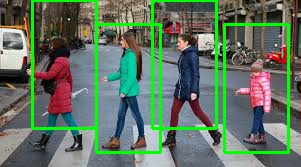

# Pedestrian-detection
Pedestrian detection using Non Maximum Suppression.

Pedestrian detection is still an unsolved problem in computer science. While
many object detection algorithms like YOLO, SSD, RCNN, Fast R-CNN and Faster
R-CNN have been researched a lot to great success but still pedestrian detection
in crowded scenes remains an open challenge. It might look strange that there 
are lot of ongoing research in fields like semantic segmentation and instance 
segmentation but we are paying less attention to some of the topics like this. 
In this post, I will go through an efficient and scalable algorithm known as Non
Maximum Suppression for solving pedestrian detection in crowded scenes.

To better understand please see the corresponding medium blog post [Pedestrian detection using Non Maximum Suppression algorithm](https://medium.com/@abhinav.sagar2016/pedestrian-detection-using-non-maximum-suppression-b55b89cefc6).

## Environment and tools

1. scikit-learn
2. scikit-Image
3. numpy
4. opencv
5. nms
6. argparse

## Data

I downloaded the images from [here](https://unsplash.com/search/photos/pedestrians).
Then I compressed the image to 300 by 200 size and used these images as test images
for this project.

## Non Maximum Suppression

History of Oriented Gradients(HOG) combined with Support Vector Machines(SVM) have
been pretty successful for detecting objects in images but the problem with those
algorithms is that they detect multiple bounding boxes surrounding the objects in
the image. Hence they are not applicable in our case that is detecting pedestrians 
on crowded roads. Here's where Non maximum suppression(NMS) comes to rescue to better
refine the bounding boxes given by detectors. In this algorithm we propose
additional penalties to produce more compact bounding boxes and thus become less
sensitive to the threshold of NMS. The ideal solution for crowds under their pipelines
with greedy NMS is to set a high threshold to preserve highly overlapped objects and
predict very compact detection boxes for all instances to reduce false positives.

## To execute

`python run.py -i sample_images/p2.jpg`

## Results

